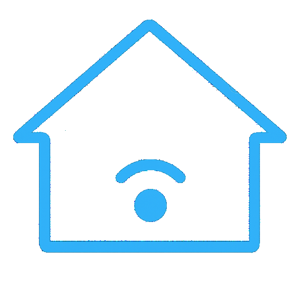

<h2 align="left">Olá 👋!  Me chamo Matheus, mas pode me chamar de BigPiloto</h2>

###

  
  

###

  
  
  
  
  
  
  
  
  
  
  
  
  
  
  
  
  
  
  
  
  
  
  
  
  
  
  
  
  
  
  
  
  
  
  
  
  
  
  
  
  

###

  
  
  
  
  
  

###

 

###

###

 

###
